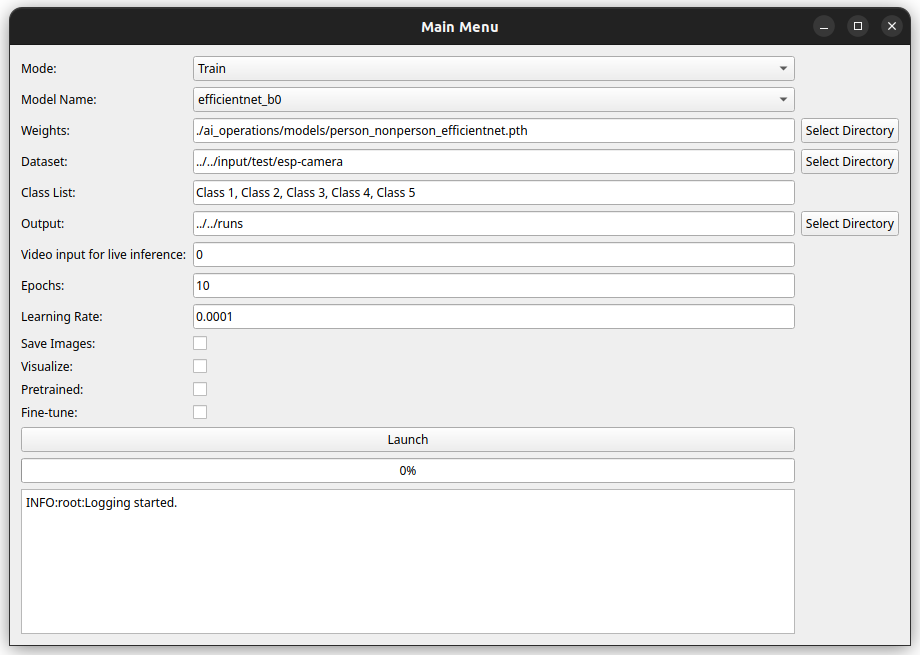

# Person Detection Project

## Overview

This project aims to explore and compare different models for person detection.
The current implementations include EfficientNet_B0 and ResNet18. MobileNetV2 is also included for comparison purposes, 
but at the moment it is not an option in the parameters. You can use it in 
[person-detection-esp32s3](https://github.com/curso-verano-iot-uah/person-detection-esp32s3)
The goal is to evaluate the performance of these models in terms of accuracy, speed, and resource requirements.
In the future, more models will be added to further expand the analysis and options.  
  

* [Models results and comparison](#models-results-and-comparison)
* [Future Models](#future-models)
* [Dataset](#dataset)
* [Getting Started](#getting-started)
* [Usage](#usage)

## Models results and comparison

### Dataset used for the results

For training, we have used the [person_dataset](input/person_dataset). Contains
two classes (person and nonperson). It is made up with images from coco dataset and
images taken grom an ESP32-CAM.  
For testing we have used the [esp-camera](input/test/esp-camera). Contains 1000 images all taken 
from an ESP32-CAM.


### MobileNetV2
- **Accuracy**  95.1%
- **F1 Score:** 0.96
- **Confusion Matrix:**

| Actual/Predicted | person | nonperson |
|------------------|--------|-----------|
| person           | 564    | 36        |
| nonperson        | 12     | 388       |


### EfficientNet
- **Accuracy** 95.8%
- **F1 Score:** 0.96
- **Confusion Matrix:**

| Actual/Predicted | person | nonperson |
|------------------|--------|-----------|
| person           | 597    | 3         |
| nonperson        | 39     | 361       |

### ResNet18
- **Accuracy** 97.1%
- **F1 Score:** 0.96
- **Confusion Matrix:**

| Actual/Predicted | person | nonperson |
|------------------|--------|-----------|
| person           | 571    | 29        |
| nonperson        | 0      | 400       |


## Future Models

In the future, additional models will be incorporated into the project to provide a broader 
range of options for person detection. Contributions and suggestions for new models are welcome.

## Getting Started

To get started with this project, follow these steps:

1. Clone the repository:

   ```bash
   git clone https://github.com/curso-verano-iot-uah/iot-segmentations.git
   cd iot-segmentations/src
   ```
2. Create a conda environment:

   ```bash
   conda env create -f environment.yaml
   ```
   
## Usage

There is an implementation for classification and segmentation.

### Classification

For classification run the [main.py](src/main.py) script and an
interactive menu will appear.



#### Mode
- **Train:** To make a fine-tuning of the model.
- **Metrics**: To evaluate the model with the dataset and obtain the confusion matrix
f1, recall and precision.
- **Local Inference (in development)**: To make inference locally with the model.
- **Live Inference (in development)**: To make inference with the webcam or other stream source.

#### Model Name
Select the model to use. At the moment only EfficientNet and ResNet18 are available.

#### Weights
Select the weights to use. For the model.

#### Dataset 

Select the folder where the dataset is saved.

#### Class list: 

Write the classes to use separated by commas. For example, person,nonperson

#### Output

Select the folder where the output will be saved. Like the model weights, the confusion matrix, labeled images, etc.

#### Video input for live inference

Select the video input to use for live inference. It can be a webcam, video file, rtsp, etc.

#### Epochs

Number of epochs to train the model.

#### Learning rate

Learning rate to train the model.

#### Save images

If selected, the images will be saved in the output folder.

#### Visualize images

If selected, the images will be shown in the screen when local inference.

#### Pretrained 

If selected, the model will be loaded with the pretrained weights for training.

#### Fine tune

If selected, the model will be fine-tuned with the dataset.

#### Launch button

When all the parameters are selected, press the launch button to start the process.


#### Log screen

The log screen will show the progress of the process (when finished).


### Segmentation

The segmentation is in development. The [main.py](src/segmentation/main.py) script is not finished yet.
But you can try yolo locally with the [yolo.py](src/models/object_detection/yolo.py) script.
Or you can try the [yoloweb.py](src/models/object_detection/yoloweb.py) script for live inference in a web server.


