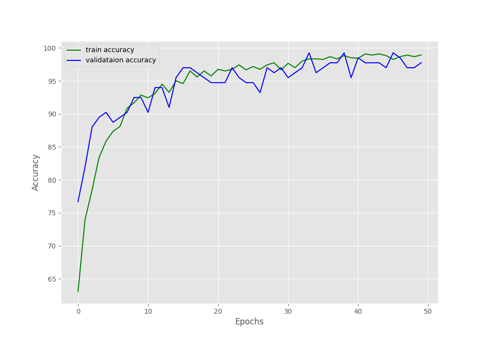
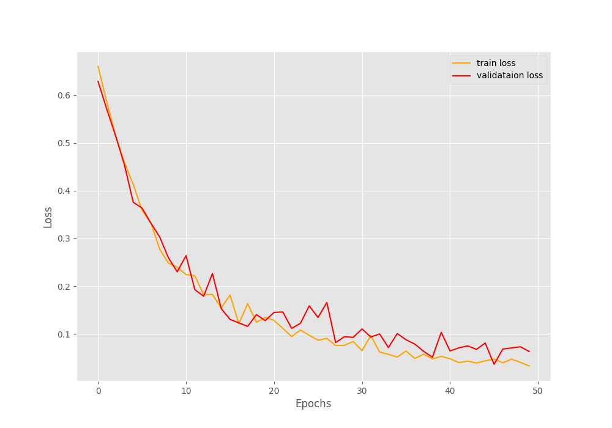
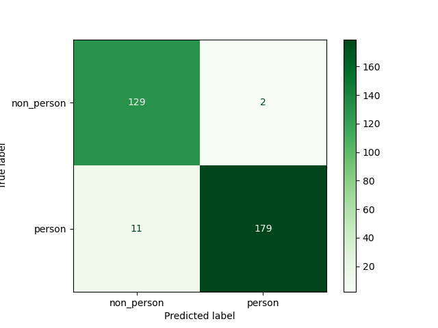

### Code for the project "Predicting humans presence using ESP-32"

# Predicting Humans Presence with ESP-32

## Overview

This project utilizes an ESP-32 microcontroller to predict human presence. The machine learning model is based on the EfficientNet architecture, fine-tuned to classify two classes: `non_person` and `person`.

## Model Fine-tuning

The EfficientNet model was fine-tuned over 50 epochs using a training dataset of 800 images. 


## Results

### Accuracy Graph



Caption: Displaying the accuracy of the model during training and validation.

### Loss Function Graph



Caption: Illustrating the variation of the loss function throughout the training process.

### Confusion Matrix



Caption: Confusion matrix depicting the model's performance on the test dataset.

## Data

All the images used for training, validation and testing are located in the `input` folder.
Inside is the 'test' folder, which contains the images used for testing the model. 
The 'person_dataset' contains the two clases with the images used for training and validation.

## Usage

1. Clone the repository:

   ```bash
   git clone https://github.com/curso-verano-iot-uah/efficient-net.git
   
2. Install the required packages:

   ```bash
   conda env create -f environment.yaml
   ```
3. Activate the environment:

   ```bash
   conda activate efficient-net
   ```
4. Run the confusion matrix script: to obtain the results of thes test dataset.

   ```bash
   python ./src/confusion_matrix.py
   ```